## Introduction

Hi everyone, welcome to the first post of RethinkSec.

Today, I will share on the basic of the Linux command. In Cybersecurity world, Linux is one of the most used OS that will be used by the industry. For penetration testing, we will normally recommend Kali Linux / Parrot Security OS. You may easily search on how to install this OS online. I will recommend using a VMware Player / Oracle VirtualBox (both are free) for you to have this OS installed.

Before we learn about cybersecurity, Linux is one of the most key ability that we need to be ready before we can move further. OverTheWire Bandit is one of the best resources that you can use to learn about it. You can ssh to the environment, and you learn the command on the go. Your objective is simple, which is find the next level password. The username is known, which are "bandit" with the level number, such as "bandit0", "bandit1" and so on.

First, we need to ssh into the environment. We can login with the command below:

```ssh bandit0@bandit.labs.overthewire.org -p 2220```

| Command | Description |
|---|---|
| ssh | SSH toolkit for you to remote access to the target environment |
| bandit0 | Username of the server / host| 
| bandit.labs.overthewire.org | Hostname |
| -p 2220 | Specify the port number (Port 22 is the default port for SSH) |

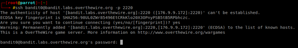

First time you may see a message such as "The authenticity of host can’t be established…  Are you sure you want to continue connecting?" For this message, you just type "yes" (without quote), then it will ask for the password, which is "bandit0".

## Level 0 > Level 1

| Info | Description |
|---|---|
| Host |bandit.labs.overthewire.org |
| Port | 2220 |
| Username | bandit0 |
| Password | bandit0 |
| URL | https://overthewire.org/wargames/bandit/bandit1.html |

The objective for Level 0 to Level 1 is we need to know the content of the file "readme" which is located in the home directory, and the file content will be the password for "bandit1". For us to read the file content of a file, we can run ```cat <filename>```. In this case, we will need to run ```cat readme```.

We can see the password is boJ9jbbUNNfktd78OOpsqOltutMc3MY1, then we can exit, and reinitiate another SSH login as "bandit1" now, with the new password.

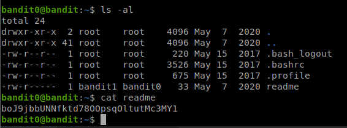

Key takeaway:
- We learnt about how to remote access to the environment via SSH
- We can read the file content with "cat" command.

## Level 1 > Level 2

| Info | Description |
|---|---|
| Host |bandit.labs.overthewire.org |
| Port | 2220 |
| Username | bandit1 |
| Password | boJ9jbbUNNfktd78OOpsqOltutMc3MY1 |
| URL | https://overthewire.org/wargames/bandit/bandit2.html |

The objective for Level 1 to Level 2 is we need to know the content of the file "-" which is located in the home directory, and the file content will be the password for "bandit2". "-" is one of the special character in Linux environment, where it is widely used by multiple environment. For example, "cd -" will bring you to the previous directory. In order for us to cat the file with the name "-", we can add a "./" before it, which means the current directory. "./-" means that the filename of "-" which is within the current directory. If you want to read the file that is from the parent directory, use "../" instead.

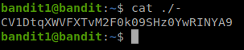

We can see the password for bandit2 is ```CV1DtqXWVFXTvM2F0k09SHz0YwRINYA9```, and we proceed with the next user.

Key takeaway:
- "-" is one of the special characters in Linux environment.

## Level 2 > Level 3

| Info | Description |
|---|---|
| Host |bandit.labs.overthewire.org |
| Port | 2220 |
| Username | bandit2 |
| Password | CV1DtqXWVFXTvM2F0k09SHz0YwRINYA9 |
| URL | https://overthewire.org/wargames/bandit/bandit3.html |

The objective for Level 2 to Level 3 is we need to know the content of the file "spaces in this filename" which is located in the home directory, and the file content will be the password for "bandit3". Space is one of the special characters where it will treat the space as a separator between commands & parameters. For example, "cat readme" means that "cat" the file with the filename "readme". So for us to read the actual file content for it, we have 2 ways to work on it.

The first way is to add a backslash in front of every space, the backslash is to tell the command that treat the space as the character itself, and do not interpret to something else. The second way is to add a double quote between the filename, so the command knows this are referring to the same thing.

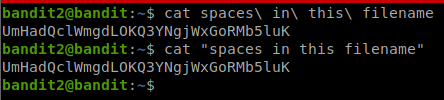

We can see the password is ```UmHadQclWmgdLOKQ3YNgjWxGoRMb5luK```, and we proceed with the next user.

Key takeaway:
- Space is one of the special characters in Linux environment, we can use either backslash or quote around the file name, so the environment knows we are talking 1 file instead of multiple files

## Level 3 > Level 4

| Info | Description |
|---|---|
| Host |bandit.labs.overthewire.org |
| Port | 2220 |
| Username | bandit3 |
| Password | UmHadQclWmgdLOKQ3YNgjWxGoRMb5luK |
| URL | https://overthewire.org/wargames/bandit/bandit4.html |

The objective for Level 3 to Level 4 is we need to know the content of a hidden file which is located in the "inhere" directory, and the file content will be the password for "bandit4". In Linux environment, in order for us to hide a file, we can simply put a dot in front of the file. So "readme" and ".readme" are different, where one of the is visible, and another one is not visible.

In order for us to list out all the hidden file, we can use ls -al
| Command | Description |
|---|---|
| ls | List command |
| -a | All files including hidden files / directory | 
| -l | List the files & directories in a list format |

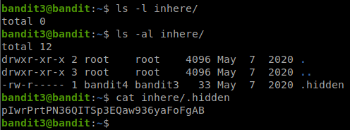

We can see if the command without "-a", it will only show those file that are not hidden. The password for bandit4 is ```pIwrPrtPN36QITSp3EQaw936yaFoFgAB```

Key takeaway:
- "." is one of the special characters in Linux environment, where it will hide the file / directory so it will not show the hidden file / directory without the "-a" flag.

## Level 4 > Level 5

| Info | Description |
|---|---|
| Host |bandit.labs.overthewire.org |
| Port | 2220 |
| Username | bandit4 |
| Password | pIwrPrtPN36QITSp3EQaw936yaFoFgAB |
| URL | https://overthewire.org/wargames/bandit/bandit5.html |

The objective for Level 4 to Level 5 is we need to know the content of a file which is located in the "inhere" directory, and only one of the file will only contain a specific human-readable word and it will be the password for "bandit4". If we are using "cat" to read the content, then our terminal will messed up with gibberish data.

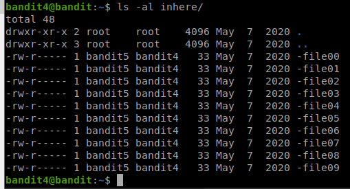

We have 2 ways to get around with this.
- Read the file content using the strings command.
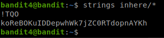

- Read the file information before we read the file using file command
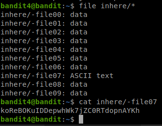

From both command above, we can see only "inhere/-file07" contain ASCII text, and the password for user bandit5 is ```koReBOKuIDDepwhWk7jZC0RTdopnAYKh```

We can also see that I used "\*" for both command. "\*" in bash means all files in the directory, it is a shortcut for us to deal with all files instead of typing them 1 by 1.

Key takeaway:
- file can be used to identify the file to see whether if the file is a text file, executable file, or others file (normally named as data)
- strings can be used to read all the file contents that are human-readable only.

## Level 5 > Level 6

| Info | Description |
|---|---|
| Host |bandit.labs.overthewire.org |
| Port | 2220 |
| Username | bandit5 |
| Password | koReBOKuIDDepwhWk7jZC0RTdopnAYKh |
| URL | https://overthewire.org/wargames/bandit/bandit6.html |

The objective for Level 5 to Level 6 is to find a file somewhere under the inhere directory that meet the requirement below:
- Human-readable
- 1033 bytes in size
- Not executable

Since there are multiple requirements, we can use find command to help us with it.

```find inhere -size 1033c ! -executable -exec file {} + | grep text```

We can split this command into few parts:
| Command | Description |
|---|---|
| find inhere | invoke find command based on inhere directory |
| -type f | Specify our result should be a file, instead of directory | 
| -size 1033c | Specify the size as 1033 bytes |
| ! -executable | Specify the file is not executable |
| -exec file {} + \| grep text | Will ask the find command to run file command to identify the file type, and grab the keyword "text" |

Now we can see the result as below:

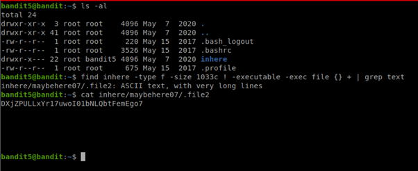

Now we can see the password for bandit 6 is ```DXjZPULLxYr17uwoI01bNLQbtFemEgo7```

Key takeaway:
- Find command can be very useful when we are required to find a certain file with conditions
- We can ask the find command to run a specific command for us.

## Level 6 > Level 7

| Info | Description |
|---|---|
| Host |bandit.labs.overthewire.org |
| Port | 2220 |
| Username | bandit6 |
| Password | DXjZPULLxYr17uwoI01bNLQbtFemEgo7 |
| URL | https://overthewire.org/wargames/bandit/bandit7.html |

The objective for Level 6 to Level 7 are similar, where we need to find a file from the entire file system that meet the requirement below:
- Owned by user bandit7
- Owned by group bandit6
- 33 bytes in size

We can use the find command again to find the file and meet the requirement:

```find / -type f -user bandit7 -group bandit6 -size 33c 2>/dev/null```

We can split this command into few parts
| Command | Description |
|---|---|
| find / | invoke find command based on file system. |
| -type f | Specify our result should be a file, instead of directory | 
| -user bandit7 | Specify the owned by user bandit7 |
| -group bandit6 | Specify the file is owned by group bandit6 |
| -size 33c | Specify the file size as 33 bytes |
| 2>/dev/null | Redirect all the gibberish information (such as permission denied) to /dev/null (which is a null device in Linux system, and will discard whatever written to it) |

Now we can see the result as below:

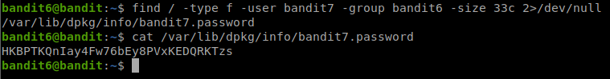


The password for bandit7 is ```HKBPTKQnIay4Fw76bEy8PVxKEDQRKTzs```.

Key takeaway:
- We can use the find command to specify the ownership for user & group.

## Level 7 > Level 8

| Info | Description |
|---|---|
| Host |bandit.labs.overthewire.org |
| Port | 2220 |
| Username | bandit7 |
| Password | HKBPTKQnIay4Fw76bEy8PVxKEDQRKTzs |
| URL | https://overthewire.org/wargames/bandit/bandit8.html |

The next challenge is fairly simple, we need to find our password that is sit next to keyword millionth from a huge file named data.txt.

We can use a nice tool called grep (we used it at Level 5 > Level 6) to grab our specific keyword. We can run the command below

```cat data.txt | grep millionth```

The output will be similar as below

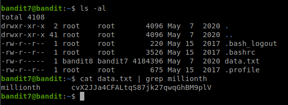

We can see the password for bandit8 is ```cvX2JJa4CFALtqS87jk27qwqGhBM9plV```.

Key takeaway:
- Grep can be useful when we just want to get the line with specific keyword.

## Level 8 > Level 9

| Info | Description |
|---|---|
| Host |bandit.labs.overthewire.org |
| Port | 2220 |
| Username | bandit8 |
| Password | HKBPTKQnIay4Fw76bEy8PVxKEDQRKTzs |
| URL | https://overthewire.org/wargames/bandit/bandit9.html |

The next challenge required us to find the password from a huge file that is occured once. We can use 2 utilities, called sort and uniq to help us accomplish the task. We can run the command below

cat data.txt | sort | uniq -u

We can split this command into few parts
| Command | Description |
|---|---|
| cat data.txt | Show all the content of data.txt |
| \| | Redirect the output as the next command input | 
| sort | Sort the output in an alphabetical order |
| uniq -u | Show only the unique lines |

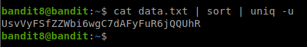

Why we must use sort? Because system will only compare the lines before and after the specific line. In other word, they cannot detect there are duplicate if the duplicated text are scattering everywhere.

We can see from the image below, the original content has a total of 1001 lines of text. If we are not sorting them, and just find the unique lines, then it will shows 991 lines, instead of 1 line only.

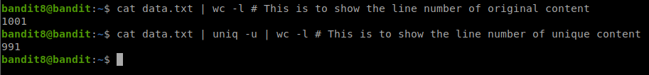

So the password for bandit9 is ```UsvVyFSfZZWbi6wgC7dAFyFuR6jQQUhR```

Key takeaway:
- We can use sort to sort the file content by lines, it is very useful when we want to sort out the randomise information
- We can use uniq to find out the uniq lines of the file content.

## Level 9 > Level 10

| Info | Description |
|---|---|
| Host |bandit.labs.overthewire.org |
| Port | 2220 |
| Username | bandit9 |
| Password | UsvVyFSfZZWbi6wgC7dAFyFuR6jQQUhR |
| URL | https://overthewire.org/wargames/bandit/bandit10.html |

The challenge is similar to the previous, where our password is now near with character "=". But the files may contain characters that are not human-readable. So instead of "cat", we use "strings" instead.

```strings data.txt | grep =```

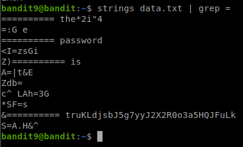

From the image above, we can see the password for bandit10 is ```truKLdjsbJ5g7yyJ2X2R0o3a5HQJFuLk```

Key takeaway:
- We can use multiple tools that we used previously in a single challenge!

## Working in progress, please come back later


